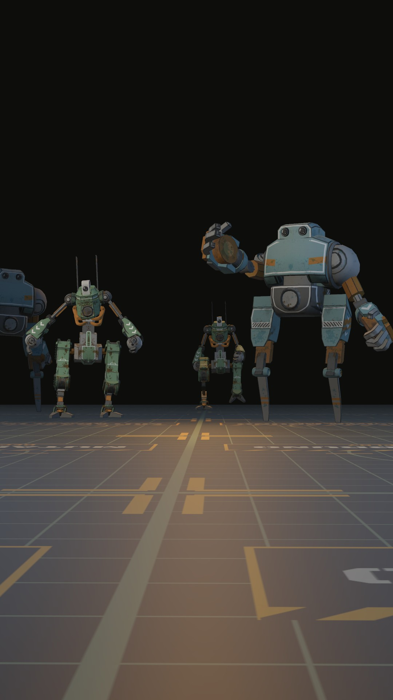

# AR Survival Shooter – Mech Salvage War

A mobile AR first-person shooter made with Unity and AR Foundation. You scan your floor, drop a small war-zone arena onto it, and then survive waves of mechs that walk across your room to get you. Your phone is the gun.

Made by **Mutabazi Ishimwe Bruno**.

<p align="center">
  
</p>

## Download

| | |
|---|---|
| APK (Android, ARCore phone) | _link coming_ |
| Demo video | [Watch on YouTube](https://youtu.be/NYWwGrzzOao) |
| Technical document | [TechnicalDocument_MutabaziIshimweBruno.pdf](Docs/TechnicalDocument_MutabaziIshimweBruno.pdf) |

## How to play

1. Pick **Easy** or **Hard** and press **Start Mission**.
2. Move the phone slowly over the floor. When the grid with my name shows up, tap it to deploy the arena. Only one arena can be placed.
3. Hold a finger anywhere on the screen to shoot at the crosshair. Turn your body and phone to aim.
4. Survive until the timer runs out. If your armour hits zero, the round ends.

Melee mechs (green) run at you and slash when they get close. Shooter mechs (blue) stop at a distance and fire slow red bolts that you can dodge by moving. Wrecks and crates in the arena block bullets, both yours and theirs.

## Features

- **AR plane detection** of horizontal surfaces, with a custom plane texture showing my name in place of Unity's default.
- **Tap to place** a single arena, anchored to the plane. Plane detection stops once it's placed.
- **Two enemy types** with different models, behaviour and health: melee mechs take 3 hits, shooter mechs take 5.
- **Object pooling** for every bullet, enemy and hit effect. Nothing is instantiated or destroyed during a round.
- **Game flow**: start menu → scan → play → end screen, with restart and main menu.
- **HUD** with a segmented armour bar, score and timer. Damage shows a red screen edge and a phone vibration.
- **Local leaderboard** of the last 5 rounds, saved to a JSON file so it survives closing the app.
- **Two difficulties** (bonus). Easy and Hard change the round length, player health, spawn rate, enemy cap, shooter ratio, enemy speed and damage.
- **Sound**: menu and battle music, 3D positional enemy sounds, mech footsteps, and an announcer for the countdown and win/lose.
- **War-zone arena** I put together from separate props: wrecked cars, barrels, crates, barricades, smoke and a concrete slab floor.

## Built with

- Unity **6000.4.7f1**, Universal Render Pipeline
- AR Foundation **6.4.3** and Google ARCore XR Plugin **6.4.3**
- Input System, TextMeshPro
- Target: **Android** (ARCore supported device), IL2CPP, ARM64, portrait

## Running it

**On a phone:** open the project in Unity 6000.4.7f1, switch the build profile to Android, connect an ARCore phone with USB debugging on, then use Build And Run with `Assets/Scenes/Game.unity`.

**In the editor without a phone:** turn on XR Simulation under *Project Settings → XR Plug-in Management → Windows*. Press Play, hold right-click and use WASD to walk around the simulated room, and left-click to tap and shoot.

## How the code is organised

```
Assets/Scripts
├── AR/        ArenaPlacer (tap to place + anchor), PlaneTrackerVisual
├── Core/      GameManager, GameEvents, GameSession, DifficultySettings
│   └── States/   GameState and the Menu / Placing / Playing / GameOver states
├── Player/    PlayerHealth, PlayerShooter, WeaponView, DamageFlash
├── Enemies/   Enemy (base), MeleeEnemy, ShooterEnemy, EnemyFactory, EnemySpawner, ArenaLayout
├── Combat/    Projectile, IDamageable
├── Pooling/   ObjectPool<T>, IPoolable, ProjectilePool
├── Effects/   EffectsManager, PooledEffect
├── Audio/     AudioManager, Sound
├── UI/        UIManager, UIPanel, one panel class per screen, SafeArea and FillScreen
├── Data/      Leaderboard
└── Utils/     ScreenInput, FpsCounter
```

The short version of the architecture:

- **GameManager** is a singleton that runs a small **state machine**. Each screen of the game flow is its own `GameState` class.
- Systems don't call each other directly. Gameplay code raises events on **GameEvents** (observer pattern), and the UI, audio, spawner, effects and leaderboard each listen for what they care about.
- **Enemy** is an abstract base class with the shared logic (health, movement, hit flash, death, score). `MeleeEnemy` and `ShooterEnemy` only override how they act each frame.
- **EnemyFactory** hands out ready enemies of a given type, and each type comes from its own **object pool**.
- **ObjectPool<T>** is one generic pool used for player bullets, enemy bullets, both enemy types, sparks and explosions.

There's more detail, with a diagram, in the technical document.

## Assets and credits

Everything below is free to use. The arena layout, UI style, plane texture, floor texture, menu art and particle textures were made for this project.

| What | Where it's from | Licence |
|---|---|---|
| Mech enemies (George, Mike) | [Quaternius – Animated Mech Pack](https://quaternius.com/packs/animatedmech.html) | CC0 |
| Gun | [Kenney – Blaster Kit](https://kenney.nl/assets/blaster-kit), recoloured | CC0 |
| Wrecked cars and debris | [Kenney – Car Kit](https://kenney.nl/assets/car-kit), recoloured | CC0 |
| Barrels, crates, barricades, rocks | [Kenney – Survival Kit](https://kenney.nl/assets/survival-kit), recoloured | CC0 |
| Sound effects and announcer | [Kenney – Audio packs](https://kenney.nl/assets/category:Audio) (Sci-fi Sounds, Impact Sounds, UI Audio, RPG Audio, Voiceover Pack Fighter) | CC0 |
| Music | [Pixabay Music](https://pixabay.com/music/search/war%20soundtrack/) | Pixabay Content License |
| Fonts | [Black Ops One](https://fonts.google.com/specimen/Black+Ops+One) and [Rajdhani](https://fonts.google.com/specimen/Rajdhani) from Google Fonts | SIL Open Font License |
